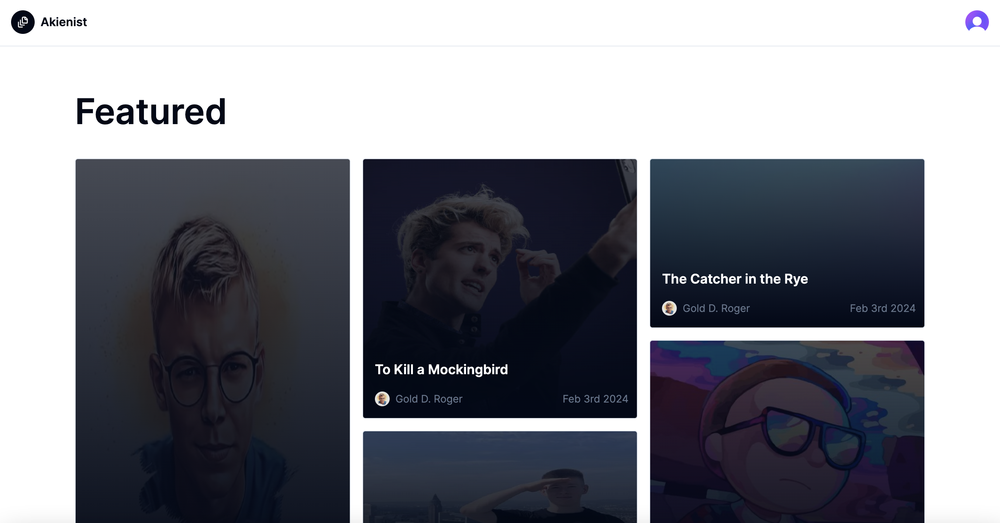
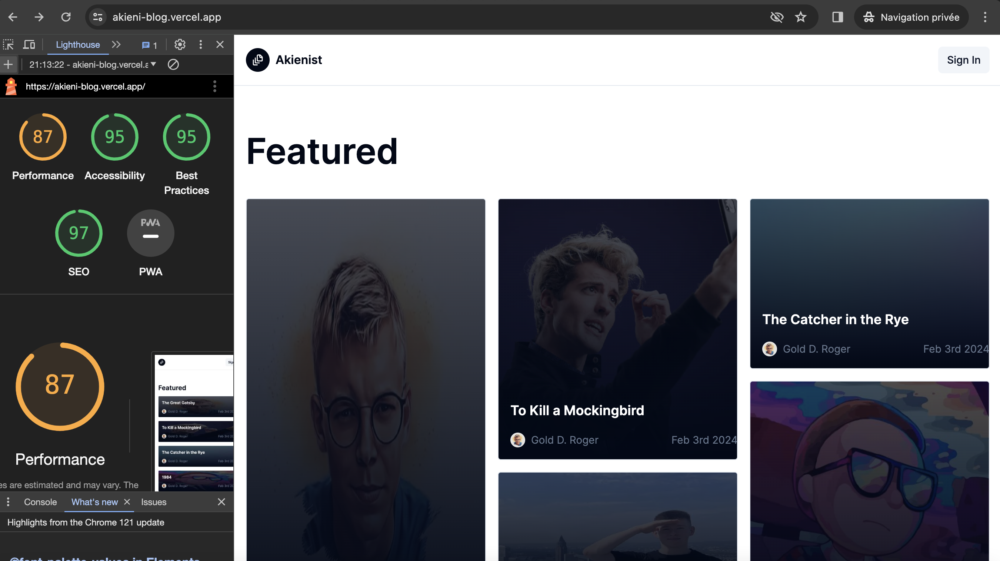

# [Akienist](https://akieni-blog.vercel.app/)

This is a blog built with everything new in Next.js 14. 

[](https://akieni-blog.vercel.app/)

## PageSpeed Insights

Lighthouse APIs to fetch and display Core Web Vitals and PageSpeed Insights results.

[]

## Tech Stack

- **Framework:** [Next.js](https://nextjs.org)
- **Styling:** [Tailwind CSS](https://tailwindcss.com)
- **User Management:** [Clerk](https://clerk.com)
- **ORM:** [Prisma](https://www.prisma.io/)
- **UI Components:** [shadcn/ui](https://ui.shadcn.com)
- **Content Management:** [Jsonplaceholder](https://jsonplaceholder.typicode.com/)
- **Validation** [Zod](https://zod.dev/)
- **Form** [React Useform](https://react-hook-form.com/)
- **Query** [Tanstack Query](https://tanstack.com/query/latest)
- **File Uploads:** [uploadthing](https://uploadthing.com)
- **Typesafe server actions** [Next safe action](https://next-safe-action.dev/)
- **Env variables validation** [T3 Env](https://env.t3.gg/docs/introduction)
- **Test** [Playwright](https://playwright.dev/)

## Features to be implemented

- [x] Authentication with **Clerk**
- [x] Api Using **Jsonplaceholder**
- [x] Validation with **Zod**
- [x] Blog with articles, authors, related, featured, likes, and comments
- [x] Admin dashboard with articles, users, comments, likes and authors
- [x] Server-side rendering(SSR) pagination and search on the dashboard
- [x] Partial prerendering(PPR) for dashboard and blog shell
- [x] Incremental static regeneration(ISR) for articles details
- [x] Infinite loading with the first page prerendered with **Tanstack query**
- [x] Test with **Playwright**
- [x] ORM using **Prisma ORM**
- [x] Database on **Railway**
- [x] Newsletter subscription with **React Email** and **Resend**
- [ ] Optimistic update to post comment **Next safe action**
- [x] Image uploads with **Uploadthing**
- [ ] Retrial augmented generation(RAG) to enable chat with the article using  **Vercel ai**
- [ ] Post generation using LLM
- [x] Opengraph-image
  
## Running Locally

1. Clone the repository

   ```bash
   git clone https://github.com/glody007/akieni-blog
   ```

2. Install dependencies using pnpm

   ```bash
   pnpm install
   ```

3. Copy the `.env.example` to `.env` and update the variables.

   ```bash
   cp .env.example .env
   ```

4. Push the database schema

   ```bash
   npx prisma db push
   ```

5. Seed the db

   ```bash
   npx prisma db seed
   ``` 
   
6. Start the development server

   ```bash
   pnpm run dev
   ```

## How do I test?

1. Run the end to end testing

   ```bash
   pnpm exec playwright test
   ```


## How do I deploy this?

Follow the deployment guides for [Vercel](https://vercel.com/new?utm_medium=default-template&filter=next.js&utm_source=create-next-app&utm_campaign=create-next-app-readme), [Netlify](https://create.t3.gg/en/deployment/netlify) and [Docker](https://create.t3.gg/en/deployment/docker) for more information.

## Notes 

- To enable a user access to the dashboard his author's flag must be true in the user table
- There must be at least 6 articles with images to show the featured section

## Project Structure

```
   ├── app/ 
   |   ├── api/....   
   |   |   ├── route.ts
   |   ├── layout.tsx(RootLayout)                
   |   ├── (blog)
   |   |   ├── loading.tsx    
   |   |   ...
   ├── lib/                    
   |   ├── utils.tsx
   |   |   ...
   ├── components/                    
   |   ├── blog/ 
   |   |   ├── header.tsx
   |   |   ├── footer.tsx 
   |   |   |   ...
   ├── config/ 
   |   ├── dashboard.ts
   |   ├── site.ts
   |   |   ...
   ├── server/ 
   |   ├── action.ts
   |   |   ...
   ├── data/ 
   |   ├── get-articles.ts
   |   |   ...
   ├── prisma/ 
   |   ├── schema.prisma
   |   ├── seed.ts
   |   |   ...
   ├── tests/ 
   |   ├── e2e
   |   |   ├── article.spec.ts
   |   |   |   ...
```

## Commits style guide
    - https://www.conventionalcommits.org/en/v1.0.0/
